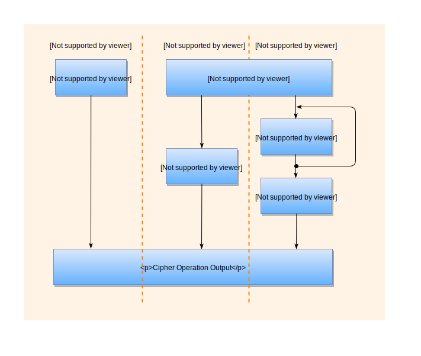

# Overview

This repository contains software used to connect and interact with the **IBM Cloud Hyper Protect Crypto Services**  offering. For more information regarding this service please review the [IBM Cloud Hyper Protect Services documentation](https://cloud.ibm.com/docs/services/hs-crypto?topic=hs-crypto-get-started). The contents of this repository use go modules, and therefore, this repository can be cloned into any local directory; there is no need to place it in your `GOPATH`.

# Contents

The contents of this repository are offered *as-is* and are subject to change at anytime.

For general information about "Enterprise PKCS #11 over gRPC" (GREP11), please see the official [documentation](https://cloud.ibm.com/docs/hs-crypto?topic=hs-crypto-introduce-cloud-hsm#access-cloud-hsm-pkcs11)

To view the documentation of the hpcs-grep11 Go module contained in this repository, type the command `godoc` (requires the installation of Go) from the cloned repository's main directory
and open a browser to [http://localhost:6060/pkg/github.com/IBM-Cloud/hpcs-grep11-go/](http://localhost:6060/pkg/github.com/IBM-Cloud/hpcs-grep11-go/).  See step 1 in the [section below](#example-setup-and-execution) for instructions on how to install Go.

# Code Examples

Included in this repository are working examples written in Go. The examples show how to use the **IBM Cloud Hyper Protect Services offering** to accomplish the following operations:

* Key generation
* Encrypt and decrypt
* Sign and verify
* Wrap and unwrap keys
* Derive keys
* Build message digest
* Retrieve mechanism information
  
## Example setup and execution

1. [Install Go](https://golang.org/doc/install).

2. Clone this repository into a local directory of your choice. Go modules are used for this
   repository, so there is no need to place the cloned repository in your `GOPATH`.

3. Update the following information in the [examples/server_test.go](examples/server_test.go#L35-L39) file.  

	*NOTE: This information can obtained by logging in to your IBM Cloud account and viewing your Hyper Protect Crypto Serverices instance and IAM information. See the [GREP11 API documentation](https://cloud.ibm.com/docs/services/hs-crypto?topic=hs-crypto-grep11-api-ref) for more information about GREP11*.

	```Golang
    // The following IBM Cloud HPCS service items need to be changed prior to running the sample program:

    var (
        address        = "<grep11_server_address>:<port>"
        apiKey         = "<ibm_cloud_apikey>"
        hpcsInstanceID = "<hpcs_instance_id>"
    )
	```
		

4. From the `<path>/hpcs-grep11-go/examples` directory, execute the examples by issuing the command: `go test -v -run Example`

5. The sample program produces output similar to the following:

    ```
    === RUN   Example_bip32_Base
    --- PASS: Example_bip32_Base (4.12s)
    === RUN   Example_bip32_KeyDerivation
    --- PASS: Example_bip32_KeyDerivation (0.19s)
    === RUN   Example_bip32_Cross_SignVerify
    --- PASS: Example_bip32_Cross_SignVerify (0.65s)
    === RUN   Example_signAndVerifyUsingECKeyPairWithEdwardsCurve
    --- PASS: Example_signAndVerifyUsingECKeyPairWithEdwardsCurve (0.20s)
    === RUN   Example_signAndVerifyEP11SingleUsingECKeyPairWithEdwardsCurve
    --- PASS: Example_signAndVerifyEP11SingleUsingECKeyPairWithEdwardsCurve (0.15s)
    === RUN   Example_getMechanismInfo
    --- PASS: Example_getMechanismInfo (0.11s)
    === RUN   Example_generateGenericKey
    --- PASS: Example_generateGenericKey (0.09s)
    === RUN   Example_encryptAndDecryptUsingAES
    --- PASS: Example_encryptAndDecryptUsingAES (0.28s)
    === RUN   Example_digest
    --- PASS: Example_digest (0.18s)
    === RUN   Example_signAndVerifyUsingRSAKeyPair
    --- PASS: Example_signAndVerifyUsingRSAKeyPair (0.21s)
    === RUN   Example_signAndVerifyUsingDSAKeyPair
    --- PASS: Example_signAndVerifyUsingDSAKeyPair (0.99s)
    === RUN   Example_deriveKeyUsingDHKeyPair
    --- PASS: Example_deriveKeyUsingDHKeyPair (0.64s)
    === RUN   Example_signAndVerifyUsingECDSAKeyPair
    --- PASS: Example_signAndVerifyUsingECDSAKeyPair (0.16s)
    === RUN   Example_signAndVerifyToTestErrorHandling
    --- PASS: Example_signAndVerifyToTestErrorHandling (0.16s)
    === RUN   Example_wrapAndUnwrapKey
    --- PASS: Example_wrapAndUnwrapKey (0.20s)
    === RUN   Example_deriveKey
    --- PASS: Example_deriveKey (0.22s)
    === RUN   Example_reencryptSingle
    --- PASS: Example_reencryptSingle (0.19s)
    === RUN   Example_slip10DeriveKey
    --- PASS: Example_slip10DeriveKey (2.98s)
    === RUN   Example_slip10CrossSignAndVerify
    --- PASS: Example_slip10CrossSignAndVerify (0.74s)
    === RUN   Example_tls
    --- PASS: Example_tls (0.14s)
    PASS
    ok      github.com/IBM-Cloud/hpcs-grep11-go/examples    13.106s
    ```

**NOTE:** By default the rewrapKeyBlob test is skipped.  This test acts as sample code that can be used to reencrypt your existing keys with a new HSM wrapping key.  See figure 8 on page 27 and page 37 in https://www.ibm.com/downloads/cas/WXRDPRAN for additional information on how existing keys can be reencrypted.  This operation requires coordination between the end-user and the **IBM Cloud Hyper Protect Crypto Services** instance's administrator(s).

## General Function Call Workflow

GREP11 can perform encrypt, decrypt, digest, sign and verify operations. For each operation, there are a series of sub-operations or functions.  

For example, the *Encrypt* operation consists of *EncryptInit()*, *Encrypt()*, *EncryptUpdate()*, *EncryptFinal()* and *EncryptSingle()* sub-operations.

#### GREP11 sub-operations for Encrypt:

- *Encrypt***Init()** is used to initialize an operation and must be run prior to *Encrypt()*, *EncryptUpdate()*, or *EncryptFinal()* calls

- *Encrypt()* is used to encrypt data without the need to perform *EncryptUpdate()* or *EncryptFinal()* sub-operations.

- *Encrypt***Update()** is used to perform update operations as part of a multi-part operation

- *Encrypt***Final()** is used to perform final operations as part of a multi-part operation

- *Encrypt***Single()** is an IBM EP11 extension to the standard PKCS #11 specification and used to perform a single call without the need to use the **Init**, **Update**, and **Final** sub-operations

The following diagram shows the three calling sequence flows that can be used for *Encrypt*, *Decrypt*, *Digest*, *Sign* and *Verify* operations:

